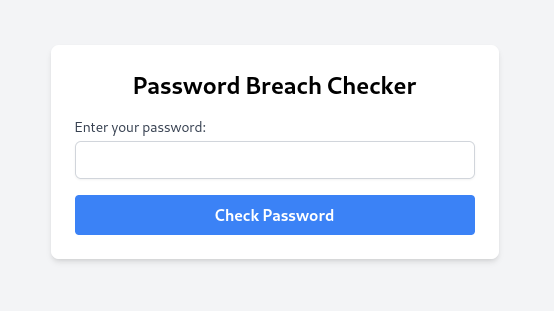
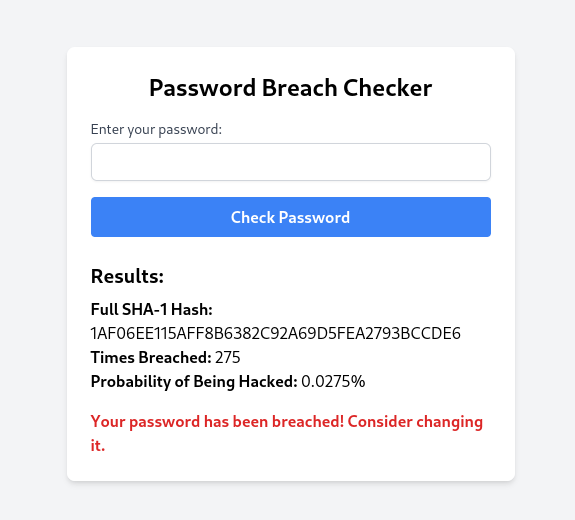

# password-breach-checker
A python application which securely checks to see if your password has been breached by utilizing a small portion of the SHA-1 encryption.

# Project structure

```
password_checker/
├── app.py
├── templates/
│   └── index.html
├── static/
│   └── css/
│       └── tailwind.css
└── requirements.txt
```

# Explaination of features
 * Full SHA-1 Hash: Displayed on the results page.
 * Times Breached: Shows how many times the password hash has been seen in breaches.
 * Probability of Being Hacked: A simple probability estimate.
 * Responsive UI: Thanks to Tailwind CSS, the UI is responsive and easy to navigate.

# Screenshots



